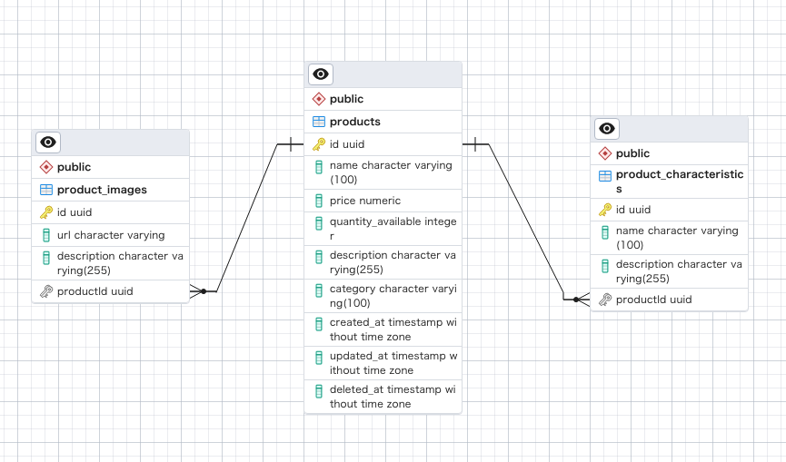

# TypeORM NestJS

## Description

TypeORM最新版（0.3.12以上）の `OneToMany` と `ManyToOne` 機能を検証する。

## Installation

```bash
$ npm install
```

## Running the app

```bash
# development
$ npm run start

# watch mode
$ npm run start:dev

# production mode
$ npm run start:prod
```

## ERD



## DB data

```bash
product=# \d
                  List of relations
 Schema |          Name           | Type  |  Owner
--------+-------------------------+-------+----------
 public | product_characteristics | table | postgres
 public | product_images          | table | postgres
 public | products                | table | postgres
(3 rows)

product=# select * from products;
-[ RECORD 1 ]------+----------------------------------------
id                 | e9be3ee6-cc51-4c76-9789-b5e1ef41eab4
name               | Example Product
price              | 29
quantity_available | 100
description        | This is an example product description.
category           | Electronics
created_at         | 2023-10-11 16:04:09.785467
updated_at         | 2023-10-11 16:04:09.785467
deleted_at         |

product=# select * from product_images;
-[ RECORD 1 ]-------------------------------------
id          | 24d01065-a6b2-494b-afd2-7857e97e01e4
url         | https://example.com/image1.jpg
description | Image 1 description
productId   | e9be3ee6-cc51-4c76-9789-b5e1ef41eab4
-[ RECORD 2 ]-------------------------------------
id          | 1ef09bd7-bb59-4da3-9998-4c0bae9c5a54
url         | https://example.com/image2.jpg
description | Image 2 description
productId   | e9be3ee6-cc51-4c76-9789-b5e1ef41eab4

product=# select * from product_characteristics;
-[ RECORD 1 ]-------------------------------------
id          | 6da98de5-8f28-47c1-a8a9-f73844a36a08
name        | Size
description | Large
productId   | e9be3ee6-cc51-4c76-9789-b5e1ef41eab4
-[ RECORD 2 ]-------------------------------------
id          | 314dba83-103d-4099-972b-e678515b59d9
name        | Color
description | Red
productId   | e9be3ee6-cc51-4c76-9789-b5e1ef41eab4
```

## License

Nest is [MIT licensed](LICENSE).
